# 目录

- [1. 前言](#1-前言)
- [2. 一些UiBot软件使用技巧](#2-一些uibot软件使用技巧)
  - [2.1. 更改Creator【我的收藏】命令树下的命令顺序](#21-更改creator我的收藏命令树下的命令顺序)
  - [2.2. 一台电脑同时打开多个Creator或Worker](#22-一台电脑同时打开多个creator或worker)
    - [2.2.1. Creator](#221-creator)
    - [2.2.2. Worker](#222-worker)
- [3. UiBot软件本身错误情况与解决方案](#3-uibot软件本身错误情况与解决方案)
- [4. 来也UiBot认证相关思维导图](#4-来也uibot认证相关思维导图)
- [5. 部分常见场景的处理思路](#5-部分常见场景的处理思路)
  - [5.1. 浏览器「打开」或「另存为」窗口的文件路径选择](#51-浏览器打开或另存为窗口的文件路径选择)
  - [5.2. 对于快速消失目标的选择方式](#52-对于快速消失目标的选择方式)
- [6. UiBot代码相关知识](#6-uibot代码相关知识)
  - [6.1. 「在目标中输入」命令，【系统消息】、【后台输入】、【模拟输入】三者之间的区别、适用情况](#61-在目标中输入命令系统消息后台输入模拟输入三者之间的区别适用情况)
- [7. 项目过程中用过的命令库和脚本](#7-项目过程中用过的命令库和脚本)
  - [7.1. Python脚本](#71-python脚本)
  - [7.2. UiBot命令库](#72-uibot命令库)
- [8. UiBot相关教程](#8-uibot相关教程)
  - [8.1. UiBot企业级流程模版](#81-uibot企业级流程模版)
  - [8.2. UiBot官方命令手册](#82-uibot官方命令手册)
  - [8.3. UiBot官方开发者指南](#83-uibot官方开发者指南)
- [9. UiBot项目实施可能涉及技术的教程](#9-uibot项目实施可能涉及技术的教程)
  - [9.1. SQL](#91-sql)
  - [9.2. 正则表达式](#92-正则表达式)
- [10. 许可证](#10-许可证)

# 1. 前言

这里是我的UiBot笔记，内容包括：

* 我在工作、学习过程中遇到的疑难问题&解决办法；
* 来也UiBot认证考试过程中，个人整理的考点、操作步骤，注意不包含考试答案；
* RPA项目实施过程中，个人觉得有用的技能与教程；
* 其他我觉得值得分享的东西。

适用范围：

* 个人常用的UiBot软件是：Creator 5.6.2和5.5.6、Worker5.6.2和5.5.6；
* 本笔记中的内容，如果没有特别说明，对于5.5.0及以后的社区版、企业版都是通用的。

本笔记的更新以GitHub为主，原因：

* UiBot社区的检索功能不好用、很多计算机常用术语都是敏感词、回复没有通知、内容权利不受个人控制。

希望达成的目的：

* 记录与展示个人的工作、学习成果，帮助职业发展；
* 帮助与自己同样使用UiBot的程序员。

RPA行业还在高速发展中，如果随着时间发展，本笔记可以在此行业留下一些痕迹，帮助到一些工程师，那将会是一件十分有成就感的事情。

# 2. 一些UiBot软件使用技巧

## 2.1. 更改Creator【我的收藏】命令树下的命令顺序

Creator软件内是没有排序功能的，以及联系过来也支持人员，得到的答复也是无法排序，但经过研究，得出了排序的方法。

以我的企业版5.6.2为例（其他版本同理），步骤与解释：

1. 打开「UiBotCreator安装目录\5.6.2\db\」文件夹
2. 使用文本编辑器打开该文件夹下的favorite.db
3. 该文件内的内容结构是这样的：

   a. 每一行的文本就是一个命令所应对的字典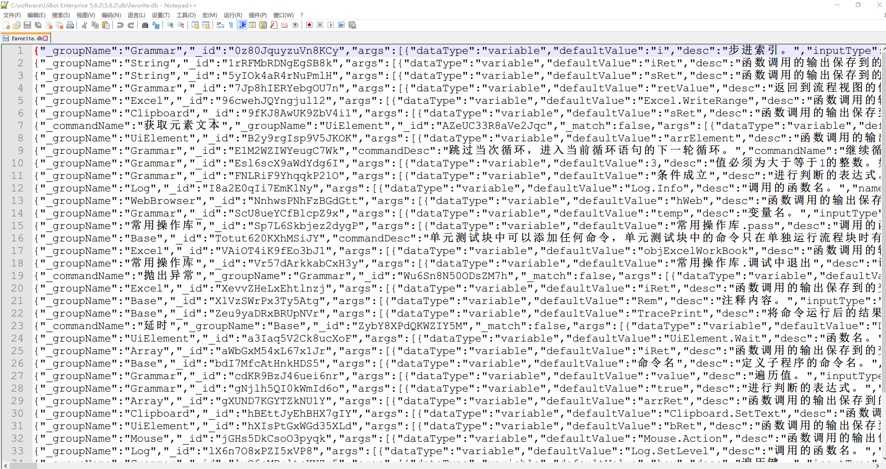
   b. 以其中的「注释」命令来举例，将其格式化一下，方便观察结构：

   ```python
   {
       "_groupName" : "Base",
       "_id" : "XlVzSWrPx3Ty5Atg",
       "args" : 
       [
           {
               "dataType" : "variable",
               "defaultValue" : "Rem",
               "desc" : "注释内容。",
               "inputType" : "textArea",
               "name" : "Rem",
               "propName" : "注释内容"
           },
           {
               "dataType" : "variable",
               "defaultValue" : "",
               "desc" : "需要显示的注释内容",
               "inputType" : "textArea",
               "name" : "sText",
               "propName" : "注释内容"
           }
       ],
       "commandDesc" : "用于给其他命令做注释说明，运行时没有任何效果。",
       "commandName" : "注释",
       "formatCode" : "Rem ",
       "propsGroup" : 
       [
           {
               "name" : "必选参数",
               "value" : 
               [
                   "#sText"
               ]
           }
       ],
       "srcCode" : "#Rem #sText",
       "time" : 1627894027311,
       "translateType" : 39,
       "visible" : true
   }
   ```

   c. 其中"time"字段就表示当时收藏该命令的毫秒时间戳，使用UiBot内置的「Unix时间戳转换为时间」，「格式化时间」命令，可以看到这个整数所对应的就是2021-08-02 16:47:07，我当初收藏它的时间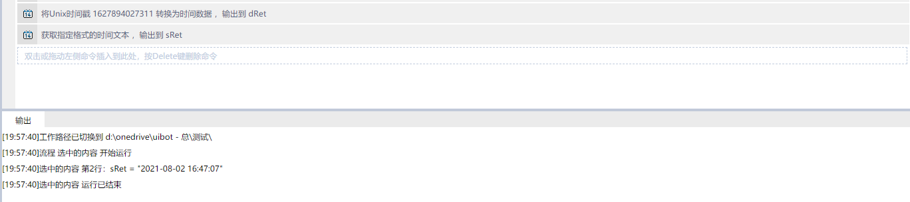
4. 那么我们只需要（先做好文件备份）在文本编辑器内，将希望排名靠前的命令字典的"time"字段整数改小，保存，关闭重开Creator，就可以了。（修改过程中如果觉得字典太长，挤在一行不方便，可以先复制字典文本到其他文本编辑器进行格式化，修改完成之后，再改为一整行的形式粘贴回去。）

举例，我将我特别常用的三个命令的"time"字段分别调整为了整数 `2，3，1`，修改前后截图如下：

（其中「调试中退出」、「pass」是我自定义的命令，不是官方内置命令，以及由于收藏的命令比较多，截图是拼接出来的，能够理解意思就行）

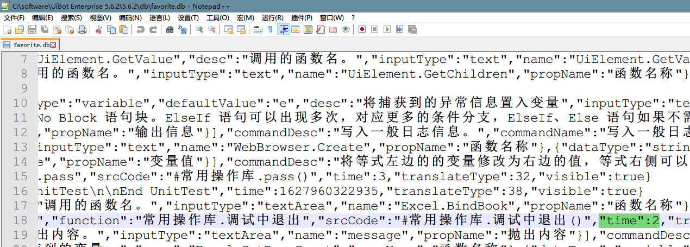

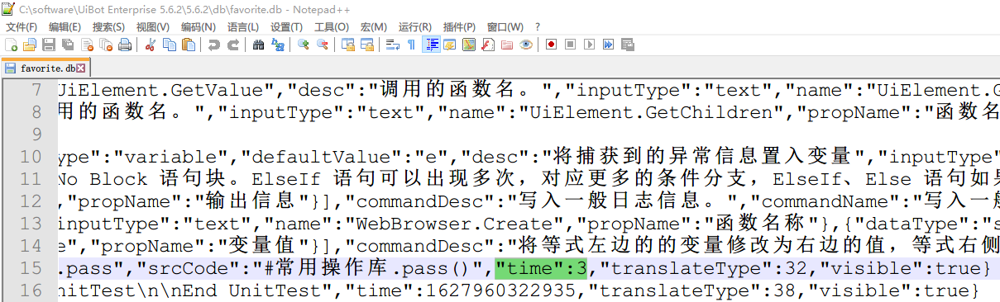

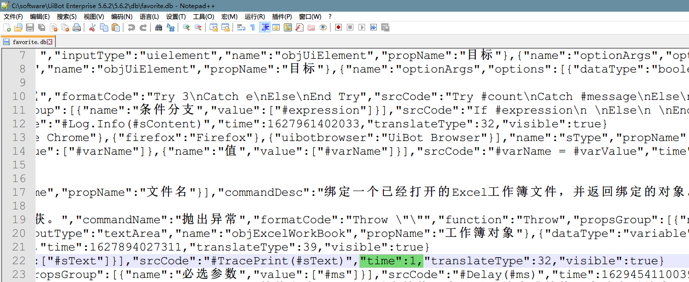

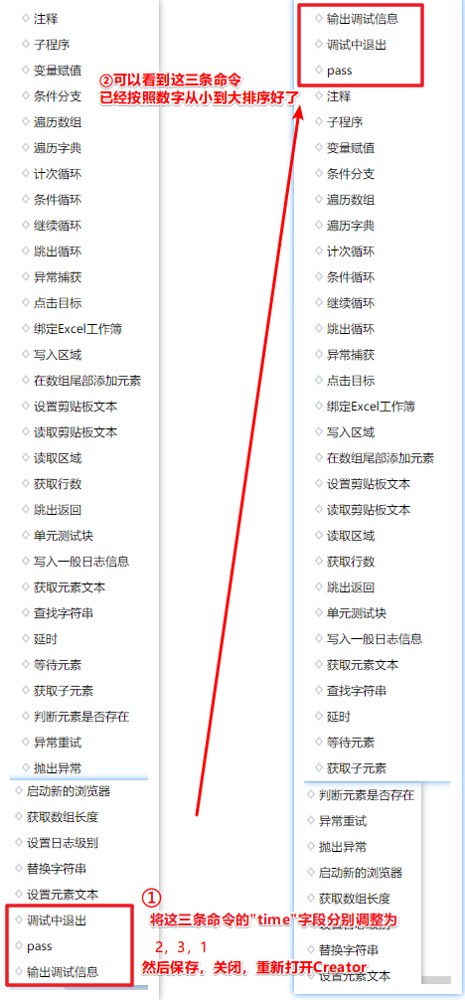

## 2.2. 一台电脑同时打开多个Creator或Worker

### 2.2.1. Creator

如果需要在两个项目之间复制粘贴代码，个人觉得最方便直观的方式，是同时安装安装不同版本的UiBot到不同文件夹，就可以实现同时打开多个Creator或Worker。

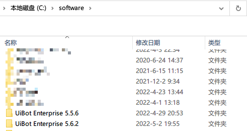

 打开每个目录中的「Creator.exe」，即可。

唯一发现的小问题，就是第二个打开的Creator无法显示最近的项目列表，手动打开需要处理的项目即可。

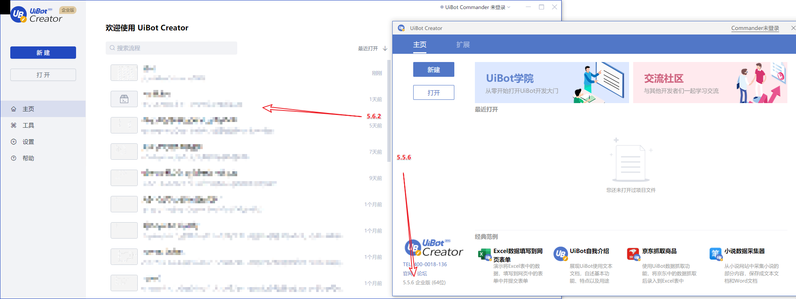

### 2.2.2. Worker

Worker同理，通过这种方式，可以实现同一台同时运行多个程序（前提是程序之间的界面操作不会互相影响），提高电脑资源利用率。

# 3. UiBot软件本身错误情况与解决方案

待更新。

# 4. 来也UiBot认证相关思维导图

截至本部分内容编写，就我所知，来也目前的产品包括：

* RPA
  * UiBot Creator，流程代码编辑器
  * UiBot Worker，流程运行工具
  * UiBot Commander，流程管理网站
  * UiBot Mage，AI功能平台
* 对话机器人吾来（Chatbot）

对于上述产品，有三个来也进行考核与颁发的认证考试

* RPA认证
  * RPA实施工程师认证
    * 以UiBot Creator的使用为主，同时涉及到UiBot Worker、UiBot Commander、UiBot Mage
    * 有初中高，三个级别
    * [认证界面](https://academy.laiye.com/certificate)
  * UiBot业务应用认证（我没考过这两个证书，不细说）
    * RPA审计机器人认证
    * RPA财务机器人认证
  * 智能自动化平合售前工程师认证 （初级）（我没考过这两个证书，不细说）
* IDP认证
  * 以UiBot Mage的使用为主，同时涉及到UiBot Creator
  * 有初中，两个级别
  * [认证界面](https://academy.laiye.com/idp/certificate)
* Chatbot认证（我没考过这个证书，不细说）
  * 有初中，两个级别
  * [认证界面](https://academy.laiye.com/chatbot/certificate)

我在个人的学习过程中，整理了两个思维导图，有的地方写得不够详细，但应该对尚未获得UiBotRPA实施高级认证、IDP中级认证的读者有一定帮助：

* RPA实施工程师高级认证的考点
  * [源文件——UiBot RPA高级认证考点.emmx（使用MindMaster可编辑）](./UiBot%20RPA高级认证考点/UiBot%20RPA高级认证考点.emmx)
  * [思维导图PDF文件——UiBot RPA高级认证考点.pdf](./UiBot%20RPA高级认证考点/UiBot%20RPA高级认证考点.pdf)
* 个人阅读IDP官方手册，并实操之后整理的UiBot Mage操作说明
  * [源文件——UiBot Mage说明整理.emmx（使用MindMaster可编辑）](./UiBot%20Mage说明整理/UiBot%20Mage说明整理.emmx)
  * [思维导图PDF文件——UiBot Mage说明整理.pdf](./UiBot%20Mage说明整理/UiBot%20Mage说明整理.pdf)
  * [大纲HTML文件——UiBot Mage说明整理-大纲.html](./UiBot%20Mage说明整理/UiBot%20Mage说明整理-大纲.html)

# 5. 部分常见场景的处理思路

## 5.1. 浏览器「打开」或「另存为」窗口的文件路径选择

以谷歌浏览器为例，在网页上传文件或下载文件的时候（如果浏览器设置了「下载前询问每个文件的保存位置」），会弹出标题为「打开」或「另存为」的文件选择窗口。

业务流程中有的场景，需要选择指定文件夹下的文件，或者将文件放到指定路径。


我个人业务处理过程中，使用的方式是：直接将文件的完整路径（文件夹路径+文件名），填写到文件名输入框，Windows就会自动进行定位。

比如"D:\UiBot Files\\file\XXXXX.pdf"、"D:\测试\新建文本文档.txt"。

这样就不需要修改窗口的地址栏，方便很多。

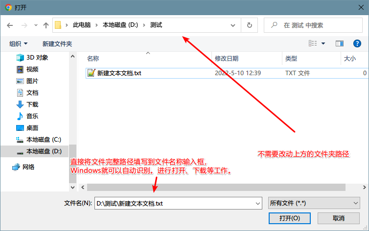

## 5.2. 对于快速消失目标的选择方式

网页处理过程中，也许某些提示文本、弹窗等在显示几秒种后，就会自动消失，此时进行目标选择的时候，可能来不及选取到它。

注意使用UiBot在选取目标的时候，屏幕左上角或右下角，会有当前鼠标位置和热键的提示，对于会快速消失的目标，常用的热键就是 `<kbd>`F2 `</kbd>`。

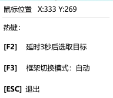

选取目标的时候，按 `<kbd>`F2 `</kbd>`，可以延迟三秒抓取目标。

再具体点说：

1. 启用目标选取（点击UiBotCreator内按钮或快捷键 `<kbd>`Ctrl `</kbd>`+`<kbd>`1 `</kbd>`）；
2. 按 `<kbd>`F2 `</kbd>`，进行3秒延迟；
3. 在3秒内进行人工操作，使待选取目标出现；
4. 3秒计时结束后，正好待选取目标提示方框未消且目标选取的延迟结束，就可以进行选取了。

# 6. UiBot代码相关知识

## 6.1. 「在目标中输入」命令，【系统消息】、【后台输入】、【模拟输入】三者之间的区别、适用情况

* 模拟操作，指通过调用系统api mouseevent等实现鼠标操作，会实际移动光标
* 系统消息，指发送鼠标消息到目标元素，不移动光标
* 后台输入，可以理解为调用了一次元素的鼠标响应回调函数

下述顺序中，由上往下为底层到上层，越底层兼容性越好，上层有速度和精准的优势：

1. 模拟
2. 消息
3. 后台

# 7. 项目过程中用过的命令库和脚本

## 7.1. Python脚本

待更新。

## 7.2. UiBot命令库

待更新。

# 8. UiBot相关教程

## 8.1. UiBot企业级流程模版

在新建项目的时候，除了「流程、命令库」，我们还可以看到「企业级流程模版」的选项，我认为如果能够理解官方所提供的企业级流程的一些要点，那么对于在中高复杂度项目中实现可靠的功能，提高个人RPA实施水平，是很有帮助的。

官方的使用指南可以在新建项目时看到，我就不放上来了。

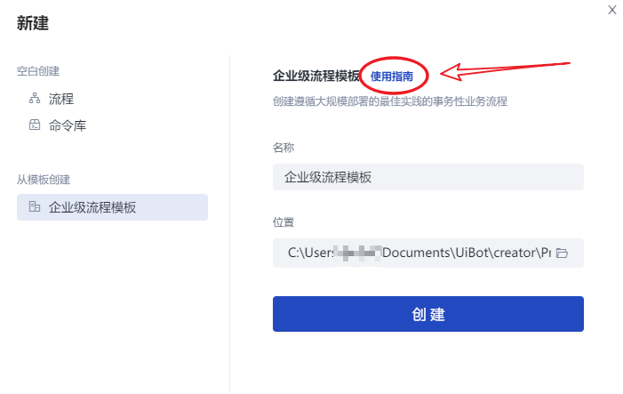

想要分享的是我自己对官方使用指南的梳理思维导图，内容中结合我个人的理解，解释了一个企业级流程涉及到哪些部分（变量、流程块、功能）、分别作用是什么。

* [源文件——UiBot企业级流程模版.emmx（使用MindMaster可编辑）](./UiBot企业级流程模版说明整理/UiBot企业级流程模版.emmx)
* [思维导图PDF文件——UiBot企业级流程模版.pdf](./UiBot企业级流程模版说明整理/UiBot企业级流程模版.pdf)
* [大纲HTML文件——UiBot企业级流程模版-大纲.html](./UiBot企业级流程模版说明整理/UiBot企业级流程模版-大纲.html)

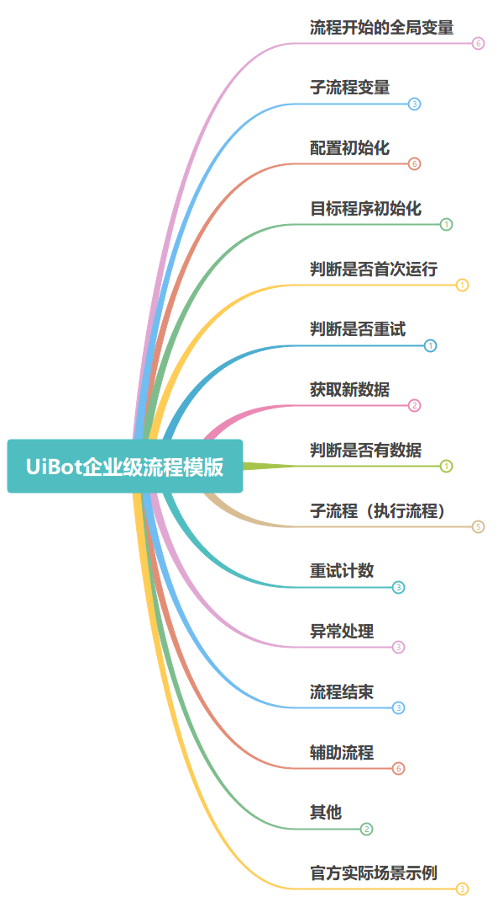

## 8.2. UiBot官方命令手册

[UiBot官方命令手册](https://documents.laiye.com/rpa-command-manual/docs/ "UiBot官方命令手册")

这个不是我自己总结出来的资料，只是觉得非常有用，所以放个链接。

目前更新到了6.0版本，比之前多了运行实例。

建议初学者浏览一遍，对各种命令的作用有个基本印象，这样在项目实施过程中，也许就能想到哪些命令可以解决自己的当前问题。

有较丰富RPA实施经验之后，这也是一份比较可靠的参考资料。

## 8.3. UiBot官方开发者指南

[https://docs.uibot.com.cn/guide/d1/]()

这个不是我自己总结出来的资料，只是觉得非常有用，所以放个链接。

初级、中级RPA实施工程师可以把官方的初级、中级开发者指南全部阅读一遍，可以了解到很多在实施过程中有帮助的技巧。

尤其是中高复杂度的项目中，掌握了流程调试、单元测试、版本控制、命令库、拓展插件等技能后，可以节省很多时间，使程序更可靠。


# 9. UiBot项目实施可能涉及技术的教程

## 9.1. SQL

UiBot可以连接并操作多种常见数据库，中大型企业的RPA项目往往也会要求读写企业数据库，所以一个RPA工程师还是有必要掌握一定的SQL知识的。

以及目前就我个人的UiBot使用经验来说（至少UiBot5.6.2版本如此），UiBot操作SQL Server的时候，每次执行「执行SQL语句」命令，会自动的创建并提交一个事务，所以实际上无法进行较复杂的事务处理，所以这种情况下建议用UiBot调用Python脚本来执行复杂事务。

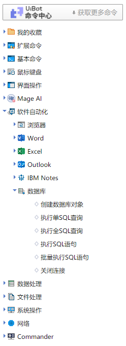

关于SQL相关书籍，个人推荐《SQL基础教程（第2版）》[日] MICK 著。

本书的内容较浅，介绍了SQL的基本知识和常见数据库的区别，个人认为非常适合入门。

掌握了书中知识后，也足够应对大多数RPA项目的需求。

如果希望获取电子书，可自行在Z-Library等网站搜索下载，我只分享我自己学习过程中整理的笔记：

* [源文件——《SQL基础教程》学习笔记.emmx（使用MindMaster可编辑）](./《SQL基础教程》学习笔记/《SQL基础教程》学习笔记.emmx)
* [思维导图PDF文件——《SQL基础教程》学习笔记.pdf](./《SQL基础教程》学习笔记/《SQL基础教程》学习笔记.pdf)
* [大纲HTML文件——《SQL基础教程》学习笔记-大纲.html](./《SQL基础教程》学习笔记/《SQL基础教程》学习笔记-大纲.html)

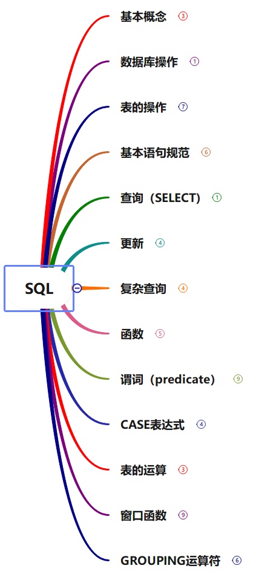

## 9.2. 正则表达式

正则表达式可以在很多情况下极大地方便文本处理，UiBot也支持正则表达式。

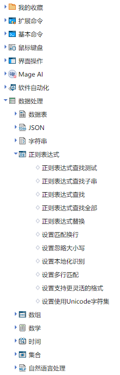

注意不同编程语言、软件对于正则表达式的支持情况是不同的，新手入门的话，我个人推荐这个教程：

[ learn-regex](https://github.com/ziishaned/learn-regex/blob/master/translations/README-cn.md " learn-regex")

正则表达式测试网站推荐（就是上述教程页面中的在线练习网站）：

[Regex101](https://regex101.com/)

以下是我学习过程中整理的笔记：

* [源文件——正则表达式学习笔记.emmx（使用MindMaster可编辑）](./正则表达式学习笔记/正则表达式学习笔记.emmx)
* [思维导图PDF文件——正则表达式学习笔记.pdf](./正则表达式学习笔记/正则表达式学习笔记.pdf)
* [大纲HTML文件——正则表达式学习笔记-大纲.html](./正则表达式学习笔记/正则表达式学习笔记-大纲.html)

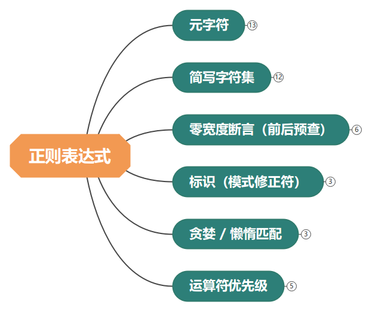

# 10. 许可证

[MIT License](../LICENSE "开源许可证")
