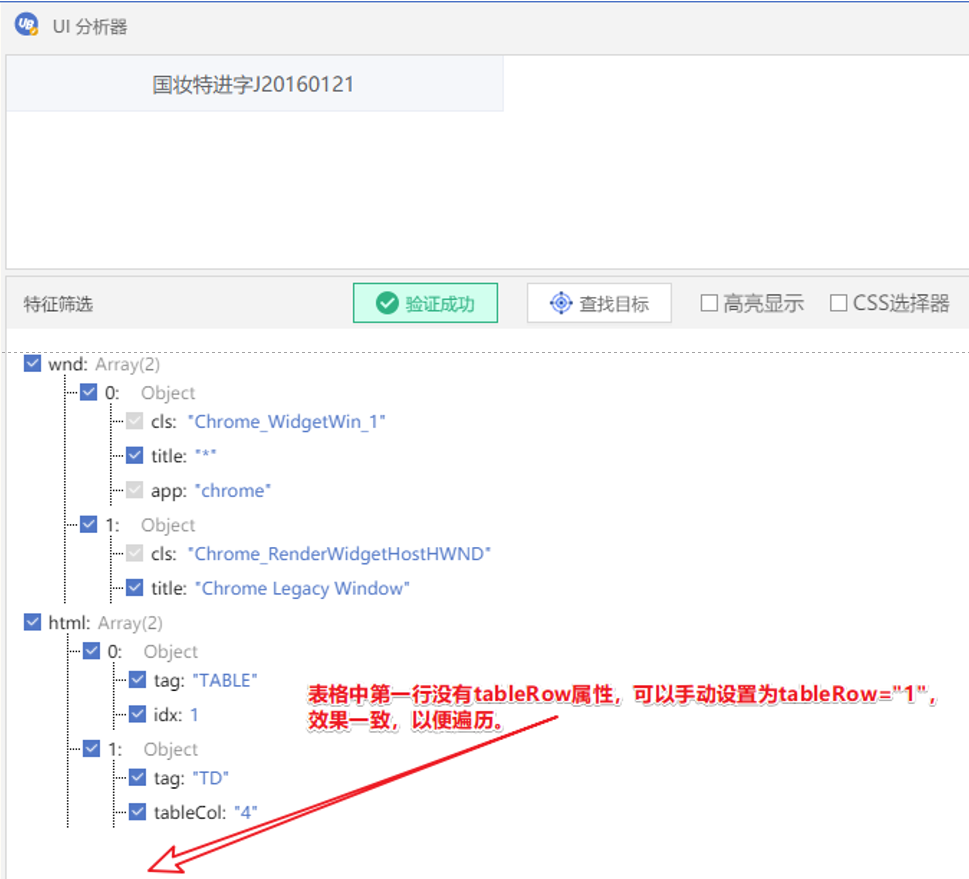
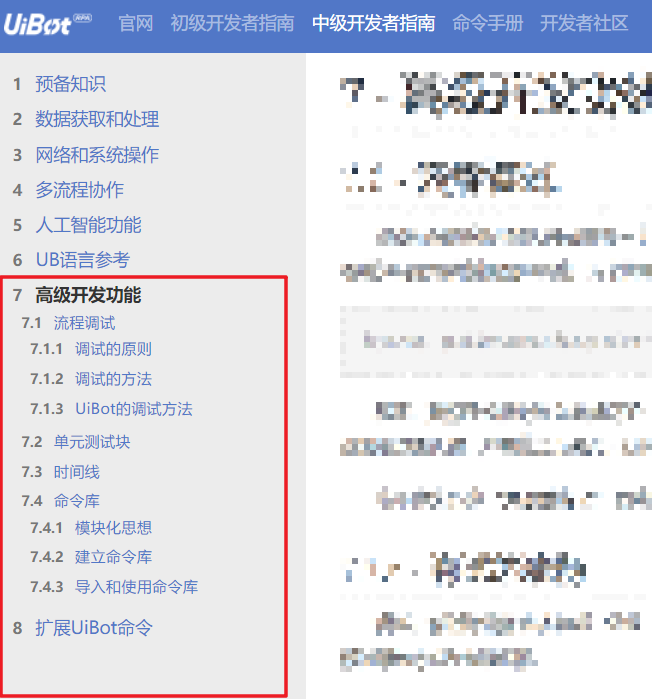

目录

- [1. 前言](#1-前言)
- [2. 一些UiBot软件使用技巧](#2-一些uibot软件使用技巧)
  - [2.1. 更改Creator【我的收藏】命令树下的命令顺序](#21-更改creator我的收藏命令树下的命令顺序)
  - [2.2. 一台电脑同时打开多个Creator或Worker](#22-一台电脑同时打开多个creator或worker)
    - [2.2.1. Creator](#221-creator)
    - [2.2.2. Worker](#222-worker)
  - [2.3. 通配符的支持情况](#23-通配符的支持情况)
- [3. UiBot软件本身错误情况与解决方案](#3-uibot软件本身错误情况与解决方案)
  - [3.1. 单元测试中循环命令报错：尝试去索引一个null值 (全局 \'__LOCAL_STORAGE_TABLE_NAME__&#39;)](#31-单元测试中循环命令报错尝试去索引一个null值-全局-local_storage_table_name)
  - [3.2. Excel读取数据，数组中显示的元素类型与实际元素类型不一致](#32-excel读取数据数组中显示的元素类型与实际元素类型不一致)
- [4. 来也UiBot认证相关思维导图](#4-来也uibot认证相关思维导图)
- [5. 部分常见场景的处理思路](#5-部分常见场景的处理思路)
  - [5.1. 浏览器「打开」或「另存为」窗口的文件路径选择](#51-浏览器打开或另存为窗口的文件路径选择)
  - [5.2. 对于快速消失目标的选择方式](#52-对于快速消失目标的选择方式)
  - [5.3. 鼠标点选日期](#53-鼠标点选日期)
    - [5.3.1. 「获取子元素」、「获取元素文本」命令结合使用](#531-获取子元素获取元素文本命令结合使用)
      - [5.3.1.1. 示例1](#5311-示例1)
      - [5.3.1.2. 示例2](#5312-示例2)
  - [5.4. 下载网页文件之后获取文件全路径](#54-下载网页文件之后获取文件全路径)
    - [5.4.1. 集合相关命令，取差集](#541-集合相关命令取差集)
    - [5.4.2. 获取浏览器下载栏中元素文本，与指定下载路径拼接](#542-获取浏览器下载栏中元素文本与指定下载路径拼接)
    - [5.4.3. 使用UiBot内置的「下载文件」命令](#543-使用uibot内置的下载文件命令)
    - [5.4.4. 使用其他工程师发布的插件](#544-使用其他工程师发布的插件)
    - [5.4.5. 网页表格依次处理每一行](#545-网页表格依次处理每一行)
- [6. UiBot代码相关知识](#6-uibot代码相关知识)
  - [6.1. 键盘、鼠标相关命令，操作类型参数中，【系统消息】、【后台输入】、【模拟输入】三者之间的区别、适用情况](#61-键盘鼠标相关命令操作类型参数中系统消息后台输入模拟输入三者之间的区别适用情况)
  - [6.2. 项目文件夹结构与不同文件作用](#62-项目文件夹结构与不同文件作用)
  - [6.3. 公共流程块封装与调用](#63-公共流程块封装与调用)
    - [6.3.1. UiBot支持哪些不同类型的封装](#631-uibot支持哪些不同类型的封装)
- [7. 命令库和脚本](#7-命令库和脚本)
  - [7.1. Python脚本](#71-python脚本)
    - [7.1.1. Python脚本怎么用](#711-python脚本怎么用)
    - [7.1.2. 钉钉群机器人发送通知](#712-钉钉群机器人发送通知)
  - [7.2. UiBot命令库](#72-uibot命令库)
- [8. UiBot相关教程](#8-uibot相关教程)
  - [8.1. UiBot企业级流程模版](#81-uibot企业级流程模版)
  - [8.2. UiBot官方命令手册](#82-uibot官方命令手册)
  - [8.3. UiBot官方开发者指南](#83-uibot官方开发者指南)
- [9. UiBot项目实施可能涉及技术的教程](#9-uibot项目实施可能涉及技术的教程)
  - [9.1. SQL](#91-sql)
  - [9.2. 正则表达式](#92-正则表达式)
- [10. 辅助软件&amp;网站](#10-辅助软件网站)
  - [10.1. Ditto——增强剪贴板功能](#101-ditto增强剪贴板功能)
  - [10.2. Snipaste——强大且便利的截图贴图工具](#102-snipaste强大且便利的截图贴图工具)
  - [10.3. 字符编码检查](#103-字符编码检查)
- [11. 许可证](#11-许可证)

# 1. 前言

这里是我的UiBot笔记，内容包括：

* 我在工作、学习过程中遇到的疑难问题&解决办法；
* 来也UiBot认证考试过程中，个人整理的考点、操作步骤，注意不包含考试答案；
* RPA项目实施过程中，个人觉得有用的技能与教程；
* 其他我觉得值得分享的东西。

适用范围：

* 个人常用的UiBot软件是：Creator 5.6.2和5.5.6、Worker5.6.2和5.5.6；
* 本笔记中的内容，如果没有特别说明，对于5.5.0及以后的社区版、企业版都是通用的。

本笔记的更新以GitHub为主，原因：

* UiBot社区的检索功能不好用、很多计算机常用术语都是敏感词、回复没有通知、内容权利不受个人控制。

希望达成的目的：

* 记录与展示个人的工作、学习成果，帮助职业发展；
* 帮助与自己同样使用UiBot的程序员。

RPA行业还在高速发展中，如果随着时间发展，本笔记可以在此行业留下一些痕迹，帮助到一些工程师，那将会是一件十分有成就感的事情。

# 2. 一些UiBot软件使用技巧

## 2.1. 更改Creator【我的收藏】命令树下的命令顺序

Creator软件内是没有排序功能的，以及联系过来也支持人员，得到的答复也是无法排序，但经过研究，得出了排序的方法。

以我的企业版5.6.2为例（其他版本同理），步骤与解释：

1. 打开「UiBotCreator安装目录\5.6.2\db\」文件夹
2. 使用文本编辑器打开该文件夹下的favorite.db
3. 该文件内的内容结构是这样的：

   a. 每一行的文本就是一个命令所应对的字典
   b. 以其中的「注释」命令来举例，将其格式化一下，方便观察结构：

   ```python
   {
       "_groupName" : "Base",
       "_id" : "XlVzSWrPx3Ty5Atg",
       "args" : 
       [
           {
               "dataType" : "variable",
               "defaultValue" : "Rem",
               "desc" : "注释内容。",
               "inputType" : "textArea",
               "name" : "Rem",
               "propName" : "注释内容"
           },
           {
               "dataType" : "variable",
               "defaultValue" : "",
               "desc" : "需要显示的注释内容",
               "inputType" : "textArea",
               "name" : "sText",
               "propName" : "注释内容"
           }
       ],
       "commandDesc" : "用于给其他命令做注释说明，运行时没有任何效果。",
       "commandName" : "注释",
       "formatCode" : "Rem ",
       "propsGroup" : 
       [
           {
               "name" : "必选参数",
               "value" : 
               [
                   "#sText"
               ]
           }
       ],
       "srcCode" : "#Rem #sText",
       "time" : 1627894027311,
       "translateType" : 39,
       "visible" : true
   }
   ```

   c. 其中"time"字段就表示当时收藏该命令的毫秒时间戳，使用UiBot内置的「Unix时间戳转换为时间」，「格式化时间」命令，可以看到这个整数所对应的就是2021-08-02 16:47:07，我当初收藏它的时间
4. 那么我们只需要（先做好文件备份）在文本编辑器内，将希望排名靠前的命令字典的"time"字段整数改小，保存，关闭重开Creator，就可以了。（修改过程中如果觉得字典太长，挤在一行不方便，可以先复制字典文本到其他文本编辑器进行格式化，修改完成之后，再改为一整行的形式粘贴回去。）

举例，我将我特别常用的三个命令的"time"字段分别调整为了整数 `2，3，1`，修改前后截图如下：

（其中「调试中退出」、「pass」是我自定义的命令，不是官方内置命令，以及由于收藏的命令比较多，截图是拼接出来的，能够理解意思就行）


## 2.2. 一台电脑同时打开多个Creator或Worker

### 2.2.1. Creator

如果需要在两个项目之间复制粘贴代码，个人觉得最方便直观的方式，是同时安装安装不同版本的UiBot到不同文件夹，就可以实现同时打开多个Creator或Worker。


 打开每个目录中的「Creator.exe」，即可。

唯一发现的小问题，就是第二个打开的Creator无法显示最近的项目列表，手动打开需要处理的项目即可。


### 2.2.2. Worker

Worker同理，通过这种方式，可以实现同一台同时运行多个程序（前提是程序之间的界面操作不会互相影响），提高电脑资源利用率。

## 2.3. 通配符的支持情况


我在UiBot的官方开发者指南、特征筛选器的提示界面中，都只看到「支持通配符 `*`」，但是其实 `?`（英文问号）也是支持的。（至少5.6.X版本支持，其他版本我没测试）

使用更合适的通配符，可以在一些情况下更精准地选取到目标元素。

* 通配符 `*`：表示任意数量字符（0个或多个）
* 通配符 `?`：表示任意1个字符

# 3. UiBot软件本身错误情况与解决方案

## 3.1. 单元测试中循环命令报错：尝试去索引一个null值 (全局 \'__LOCAL_STORAGE_TABLE_NAME__')

UiBotCreator的5.6.X版本，在单元测试用遍历数组、遍历字典、计次循环这几个循环类型的命令，会报错 `尝试去索引一个null值 (全局 'LOCAL_STORAGE_TABLE_NAME')`

在其他版本未发现该问题，咨询来也支持人员也没什么好的解决办法，所以应该是软件问题。

因此在5.6.X版本编写程序时，避免在单元测试用使用「遍历数组、遍历字典、计次循环」命令。


## 3.2. Excel读取数据，数组中显示的元素类型与实际元素类型不一致

[UiBot命令手册——读取区域](https://documents.laiye.com/rpa-command-manual/docs/Excel/ReadRange)

UiBotCreator5.6.X版本，在Excel-读取区域、读取行、读取列命令中，增加了 `显示即返回`参数。

参考官方文档说明：

> 选择是，则返回内容与Excel单元格中显示的内容一致，且始终以字符串形式返回(当单元格内容有换行时，返回的内容会在首尾自动加上双引号)；选择否，则返回内容会根据数据类型自动转换，如0.1返回数值0.1而不是字符串"0.1"

如果设置 `显示即返回`参数为「否」，

当我们打印数组，想看看数组中的元素时，会看到数组中所有元素的类型，看起来都是字符串。

但其实这是UiBot显示错误，当我们使用具体某个元素时，就会发现UiBot按照文档说明的那样，自动进行了类型转换，但是直接打印整个数组所显示的变量类型是错误的。

因此在5.6.X版本编写程序时，注意最好保持 `显示即返回`参数为默认的「是」，然后在使用数据时再根据自己的需求转换类型。


# 4. 来也UiBot认证相关思维导图

截至本部分内容编写，就我所知，来也目前的产品包括：

* RPA
  * UiBot Creator，流程代码编辑器
  * UiBot Worker，流程运行工具
  * UiBot Commander，流程管理网站
  * UiBot Mage，AI功能平台
* 对话机器人吾来（Chatbot）

对于上述产品，有三个来也进行考核与颁发的认证考试

* RPA认证
  * RPA实施工程师认证
    * 以UiBot Creator的使用为主，同时涉及到UiBot Worker、UiBot Commander、UiBot Mage
    * 有初中高，三个级别
    * [认证界面](https://academy.laiye.com/certificate)
  * UiBot业务应用认证（我没考过这两个证书，不细说）
    * RPA审计机器人认证
    * RPA财务机器人认证
  * 智能自动化平合售前工程师认证 （初级）（我没考过这两个证书，不细说）
* IDP认证
  * 以UiBot Mage的使用为主，同时涉及到UiBot Creator
  * 有初中，两个级别
  * [认证界面](https://academy.laiye.com/idp/certificate)
* Chatbot认证（我没考过这个证书，不细说）
  * 有初中，两个级别
  * [认证界面](https://academy.laiye.com/chatbot/certificate)

我在个人的学习过程中，整理了两个思维导图，有的地方写得不够详细，但应该对尚未获得UiBotRPA实施高级认证、IDP中级认证的读者有一定帮助：

* RPA实施工程师高级认证的考点
  * [源文件——UiBot RPA高级认证考点.emmx（使用MindMaster可编辑）](./UiBot%20RPA高级认证考点/UiBot%20RPA高级认证考点.emmx)
  * [思维导图PDF文件——UiBot RPA高级认证考点.pdf](./UiBot%20RPA高级认证考点/UiBot%20RPA高级认证考点.pdf)
* 个人阅读IDP官方手册，并实操之后整理的UiBot Mage操作说明
  * [源文件——UiBot Mage说明整理.emmx（使用MindMaster可编辑）](./UiBot%20Mage说明整理/UiBot%20Mage说明整理.emmx)
  * [思维导图PDF文件——UiBot Mage说明整理.pdf](./UiBot%20Mage说明整理/UiBot%20Mage说明整理.pdf)
  * [大纲HTML文件——UiBot Mage说明整理-大纲.html](./UiBot%20Mage说明整理/UiBot%20Mage说明整理-大纲.html)

# 5. 部分常见场景的处理思路

## 5.1. 浏览器「打开」或「另存为」窗口的文件路径选择

以谷歌浏览器为例，在网页上传文件或下载文件的时候（如果浏览器设置了「下载前询问每个文件的保存位置」），会弹出标题为「打开」或「另存为」的文件选择窗口。

业务流程中有的场景，需要选择指定文件夹下的文件，或者将文件放到指定路径。


我个人业务处理过程中，使用的方式是：直接将文件的完整路径（文件夹路径+文件名），填写到文件名输入框，Windows就会自动进行定位。

比如"D:\UiBot Files\\file\XXXXX.pdf"、"D:\测试\新建文本文档.txt"。

这样就不需要修改窗口的地址栏，方便很多。


## 5.2. 对于快速消失目标的选择方式

网页处理过程中，也许某些提示文本、弹窗等在显示几秒种后，就会自动消失，此时进行目标选择的时候，可能来不及选取到它。

注意使用UiBot在选取目标的时候，屏幕左上角或右下角，会有当前鼠标位置和热键的提示，对于会快速消失的目标，常用的热键就是 `<kbd>`F2 `</kbd>`。


选取目标的时候，按 `<kbd>`F2 `</kbd>`，可以延迟三秒抓取目标。

再具体点说：

1. 启用目标选取（点击UiBotCreator内按钮或快捷键 `<kbd>`Ctrl `</kbd>`+`<kbd>`1 `</kbd>`）；
2. 按 `<kbd>`F2 `</kbd>`，进行3秒延迟；
3. 在3秒内进行人工操作，使待选取目标出现；
4. 3秒计时结束后，正好待选取目标提示方框未消失且目标选取的延迟结束，就可以进行选取了。

相关视频教程链接：[常见RPA场景解决方案 (回放+源码)——快速消失目标的选择（29:20 - 32:30）](https://mp.weixin.qq.com/s/iTqDuYeLvIM2HGV63WxPZw)

## 5.3. 鼠标点选日期

在项目实施过程中，有的时候会遇到需要选择具体日期，且日期无法通过文本直接输入，只能鼠标点击，对此介绍一种适用情况较多的处理思路。

相关视频教程链接：[常见RPA场景解决方案 (回放+源码)——网页日历选择日期（15:42 - 29:12）](https://mp.weixin.qq.com/s/iTqDuYeLvIM2HGV63WxPZw)

### 5.3.1. 「获取子元素」、「获取元素文本」命令结合使用

#### 5.3.1.1. 示例1


第一个例子，可访问[https://wallstreetcn.com/calendar](https://wallstreetcn.com/calendar)进行测试，这个日期选择框是使用HTML的Table相关标签组成的，通过UiBotCreator内置的UI分析器，我们可以看出来它的TBODY（TableBody）包含7个TR（TableRow）组成，每个TR包含7个TD（TableData）。


需要注意的是，一般的每月日历表格中，每行会显示7天，第一行可能包含上月的22-31日，最后一行可能包含下月的1-6日。

那么我们假设需要选择2022年5月5日，大概思路：

1. 创建2个Boolean变量，分别用于标记是否找到了当月的第一日（称其为「月初标记」；是否找到了目标日期（称其为「寻找完成标记」）。
2. 针对TBODY元素，使用「获取子元素」命令，获取包含多个TR元素的数组（称其为「TR数组」）；
3. 遍历TR数组，
   1. 针对每个TR元素，使用「获取子元素」命令，获取包含多个TD元素的数组（称其为「TD数组」）；
   2. 遍历TD数组，针对每个TD元素，使用「获取元素文本」命令；
      1. 如果元素的文本为"1"，表示我们找到了当月的第一天，月初标记设置为为真。否则继续循环处理；
      2. 如果月初标记为真，且元素文本为"5"，说明就是我们要找的日期，点击该元素，寻找完成标记设置为真，退出循环；
   3. 如果寻找完成标记为真，则退出循环，否则继续下一次遍历；

示例代码：

```UiBot
Rem 年、月的选择一般更简单，代码演示就不涉及了。直接给出某一日。
目标日期  = "01"
Rem 创建两个标记
是否找到月初    = False
是否找到目标日期      = False
Rem 获取TBODY的子元素列表（TR，表格的行）
#icon("@res:default.png")
TR数组    = UiElement.GetChildren({"wnd":[{"cls":"Chrome_WidgetWin_1","title":"*","app":"chrome"},{"cls":"Chrome_RenderWidgetHostHWND","title":"Chrome Legacy Window"}],"html":[{"tag":"TBODY"}]},1,{"bContinueOnError":False,"iDelayAfter":20,"iDelayBefore":20})
For Each TR In TR数组
	Rem 外层遍历，获取TR的子元素列表（TD，单元格）
	#icon("@res:default.png")
	TD数组    = UiElement.GetChildren(TR,1,{"bContinueOnError":False,"iDelayAfter":20,"iDelayBefore":20})

	For Each TD In TD数组
		Rem 内层遍历，获取当前单元格的文本，并进行判断

		#icon("@res:default.png")
		日期文本    = UiElement.GetValue(TD, {"bContinueOnError": False, "iDelayAfter": 20, "iDelayBefore":20})
		TracePrint(日期文本)
		If 日期文本="01"
			Rem 如果找到月初，标记一下
			是否找到月初    = True

		Else

		End If
		If 日期文本=目标日期 And 是否找到月初=True   

			Rem 如果已经找到了月初，且当前单元格的日期和目标日期一样，就点击它，然后标记已找到目标日期，以便外层循环的跳出。
			#icon("@res:default.png")
			Mouse.Action(TD, "left", "click", 10000, {"bContinueOnError": False, "iDelayAfter": 300, "iDelayBefore": 200, "bSetForeground": True, "sCursorPosition": "Center", "iCursorOffsetX": 0, "iCursorOffsetY": 0, "sKeyModifiers": [], "sSimulate":"simulate", "bMoveSmoothly":False})
			是否找到目标日期      = True
			Rem 找到目标日期了，没必要继续遍历下去了，退出内层循环。（退出循环命令只对当前循环代码块生效，想直接退出多层循环的话，可以封装为子程序，然后return，或直接exit()退出流程）
			Break
		Else

		End If
	Next
	If 是否找到目标日期 = True
		Rem 内层循环找到目标日期的话，退出外层循环。

		Break
	Else

	End If
Next


```

#### 5.3.1.2. 示例2


第二个例子，可访问[http://tools.2345.com/rili.htm](http://tools.2345.com/rili.htm)进行测试，

这个日期选择框是一个有序列表（ol，ordered list）内包含了多个列表项（li），每个列表项表示一日。

思路和第一个例子差不多，代码如下：

```UiBot
Rem 代码中使用 UiBot 5.6.2，谷歌浏览器

Rem 填写年月日
arrRet = 返回年月日()
Rem 激活并重置谷歌浏览器窗口
Window.SetActive({"wnd":[{"cls":"Chrome_WidgetWin_1","title":"*-2345万年历 - Google Chrome","app":"chrome"}]})
Keyboard.Press("F5", "press", [],{"iDelayAfter":300,"iDelayBefore":200,"sSimulate":"simulate"})
Rem 拆分出来年月日。
年 = arrRet[0]
月 = arrRet[1]
日 = arrRet[2]
TracePrint(年&月&日)

点击年份(年)
点击月份(月)
点击日(日)

Function 返回年月日()
	输入时间 = Dialog.InputBox("输入1991-2049之间的日期，如2016-09-09","UiBot","2016-09-09",False)
	arrRet = Split(输入时间,"-")
	Return arrRet
End Function

Function 点击年份(年)
	年 = CInt(年)
	Mouse.Action({"wnd":[{"cls":"Chrome_WidgetWin_1","title":"*","app":"chrome"},{"cls":"Chrome_RenderWidgetHostHWND","title":"Chrome Legacy Window"}],"html":[{"tag":"DIV","parentid":"wrap","css-selector":"body>div>div>div>div>div"}]},"left","click",10000,{"bContinueOnError":False,"iDelayAfter":300,"iDelayBefore":200,"bSetForeground":True,"sCursorPosition":"Center","iCursorOffsetX":0,"iCursorOffsetY":0,"sKeyModifiers":[],"sSimulate":"simulate","bMoveSmoothly":False})
	索引 = 年-1901
	Mouse.Action({"wnd":[{"cls":"Chrome_WidgetWin_1","title":"*","app":"chrome"},{"cls":"Chrome_RenderWidgetHostHWND","title":"Chrome Legacy Window"}],"html":[{"tag":"LI","idx":索引}]},"left","click",10000,{"bContinueOnError":False,"iDelayAfter":300,"iDelayBefore":200,"bSetForeground":True,"sCursorPosition":"Center","iCursorOffsetX":0,"iCursorOffsetY":0,"sKeyModifiers":[],"sSimulate":"simulate","bMoveSmoothly":False})
End Function

Function 点击月份(月)
	月 = LTrim(月,"0")
	月 = CInt(月)
	Mouse.Action({"wnd":[{"cls":"Chrome_WidgetWin_1","title":"*","app":"chrome"},{"cls":"Chrome_RenderWidgetHostHWND","title":"Chrome Legacy Window"}],"html":[{"tag":"DIV","parentid":"wrap","css-selector":"body>div>div>div>div>div","idx":1}]},"left","click",10000,{"bContinueOnError":False,"iDelayAfter":300,"iDelayBefore":200,"bSetForeground":True,"sCursorPosition":"Center","iCursorOffsetX":0,"iCursorOffsetY":0,"sKeyModifiers":[],"sSimulate":"simulate","bMoveSmoothly":False})
	索引 = 月-1
	Mouse.Action({"wnd":[{"cls":"Chrome_WidgetWin_1","title":"*","app":"chrome"},{"cls":"Chrome_RenderWidgetHostHWND","title":"Chrome Legacy Window"}],"html":[{"tag":"LI","parentid":"select-month","idx":索引}]},"left","click",10000,{"bContinueOnError":False,"iDelayAfter":300,"iDelayBefore":200,"bSetForeground":True,"sCursorPosition":"Center","iCursorOffsetX":0,"iCursorOffsetY":0,"sKeyModifiers":[],"sSimulate":"simulate","bMoveSmoothly":False})
End Function

Function 点击日(日)
	月初标记  = False
    寻找完成标记  = False
    日 = LTrim(日,"0")
    arrElement = UiElement.GetChildren({"wnd":[{"cls":"Chrome_WidgetWin_1","title":"*","app":"chrome"},{"cls":"Chrome_RenderWidgetHostHWND","title":"Chrome Legacy Window"}],"html":[{"tag":"OL"}]},1,{"bContinueOnError":False,"iDelayAfter":20,"iDelayBefore":20})
    For Each value In arrElement
        temp  = UiElement.GetValue(value, {"bContinueOnError": False, "iDelayAfter": 20, "iDelayBefore":20})
        TracePrint($PrevResult)
        temp = DigitFromStr(temp)
        TracePrint($PrevResult)
        If temp="1" And 月初标记 = False
            月初标记 = True
            TracePrint("找到月初。")
        End If
        If temp=日 And 月初标记 = True
            寻找完成标记 = True
            Mouse.Action(value, "left", "click", 10000, {"bContinueOnError": False, "iDelayAfter": 300, "iDelayBefore": 200, "bSetForeground": True, "sCursorPosition": "Center", "iCursorOffsetX": 0, "iCursorOffsetY": 0, "sKeyModifiers": [], "sSimulate":"simulate", "bMoveSmoothly":False})
            Break
        End If
    Next
    If 寻找完成标记  = False
        TracePrint("没有找到对应日期。")
    End If
End Function
```

---

以上示例演示的是「日」的选择，如果需要选择「年、月」，大体思路：

* 方向按键选择
  * 计算当前年份与目标年份差值
  * 然后鼠标点击对应方向、对应次数
  * 有的情况需要键盘的方向键（↑、↓、←、→）
* 直接点击具体年份、月份
  * 需要观察、修改目标特征值
* 填写具体年份、月份
  * 最简单，一般直接填写即可

相关视频教程链接：[开发者问题解答·第6期（回放+源码）——日期如果需要设置年月日，如何处理（42:50 - 55:50）](https://mp.weixin.qq.com/s/-yLAaZ9GBANCyewDY2hP-Q)

## 5.4. 下载网页文件之后获取文件全路径

假设我们需要从网页上下载一个名称不固定的文件，目前我能想到以下几种解决方式：

1. 集合相关命令，取差集；
2. 获取浏览器下载栏中元素文本，与指定下载路径拼接；
3. 使用UiBot内置的「下载文件」命令；
4. 使用其他工程师发布的插件；

### 5.4.1. 集合相关命令，取差集

这种解决方式我觉得适合耗时较长、需要下载大量文件并获取文件列表的情况。

举例和展示代码感觉比较麻烦，给出个大概思路吧：

1. 下载开始前，使用「获取文件列表」命令，获取下载目标文件夹当前的文件列表，并将文件列表保存到集合（称之为「原始文件集合」）；
2. 进行所有文件的下载；
3. 所有文件下载结束后（比如最后一个文件下载结束后再等一段时间），再次执行步骤1，获取下载结束后的文件列表，同样保存到一个集合（称之为「下载后文件集合」）；
4. 将「原始文件集合」与「下载后文件集合」取差集，并转为数组，就得到了步骤2下载的所有文件的全路径，可以依次对每个文件进行处理了。


### 5.4.2. 获取浏览器下载栏中元素文本，与指定下载路径拼接

这种解决方式是我RPA实践过程中，觉得相对简单、通用的，且都是用UiBot内置命令实现。

相关视频教程链接：[开发者问题解答·第6期（回放+源码）——下载网页文件获取全路径（01:33 - 28:12）](https://mp.weixin.qq.com/s/-yLAaZ9GBANCyewDY2hP-Q)

以通过谷歌浏览器下载[官方更新日志](https://forum.uibot.com.cn/thread-54.htm)中的UiBot Creator5.6.0 X64 社区版 为例：

使用「获取元素文本」命令来获取下载栏的元素文本，会发现，当文件还未下载完成的时候，元素文本中不仅包含元素的文件名，文件名前方还有「已下载XXX/XXX MB，还需 XX秒」的字样。


下载完成之后，目标特征值中就是完整文件名了（**注意，文件名最前面有个多余的空格**）。


所以，当我们要下载的文件的名称不固定的时候，在「等待元素」、「获取元素文本」命令中使用通配符（通配符如何更精准的使用，可查看本笔记2.3章节），就可以很方便的「实现等待文件下载完成，然后获取文件名称」。

将文件名称最前面的多余空格去掉，再与浏览器下载文件夹路径拼接（我的下载文件夹就是浏览器默认的，实际编程中根据自己情况修改），就是刚才下载好的文件全路径了。

**注意，小文件可能会在下载完成之前，就能获取到文件名（元素文本不会像上面说的那样，包含下载进度），这种情况下，要结合「判断文件是否存在」来使用**，再具体点说：

1. 获取到文件名称后，写个循环，每隔1秒判断文件是否存在;
2. 如果不存在，则继续循环;
3. 如果存在，则结束循环，进行后续处理。


示例代码（5.6.0版本及以上）：

```UiBot
浏览器默认下载路径    = '''C:\Users\XXX\Downloads\'''

UiElement.Wait({"wnd":[{"app":"chrome","cls":"Chrome_WidgetWin_1","title":"UiBot版本更新日志-通知公告-UiBot RPA技术开发交流社区 - RPA机器人流程自动化 - UiBot RPA开发者社区 - Google Chrome"}],"ctrl":[{"role":"ROLE_SYSTEM_PANE","name":"UiBot版本更新日志-通知公告-UiBot RPA技术开发交流社区 - RPA机器人流程自动化 - UiBot RPA开发者社区 - Google Chrome"},{"role":"ROLE_SYSTEM_PANE","name":"Google Chrome"},{"role":"ROLE_SYSTEM_GROUPING","name":"下载内容栏"},{"role":"ROLE_SYSTEM_GROUPING","name":" UiBot_Community_Official_X64_V?.?.?_????.??.??.*.exe"},{"role":"ROLE_SYSTEM_PUSHBUTTON","name":" UiBot_Community_Official_X64_V?.?.?_????.??.??.*.exe"}]}, "show", 10000, {"bContinueOnError": False, "iDelayAfter": 300, "iDelayBefore":200})

文件名称 = UiElement.GetValue({"wnd":[{"app":"chrome","cls":"Chrome_WidgetWin_1","title":"UiBot版本更新日志-通知公告-UiBot RPA技术开发交流社区 - RPA机器人流程自动化 - UiBot RPA开发者社区 - Google Chrome"}],"ctrl":[{"role":"ROLE_SYSTEM_PANE","name":"UiBot版本更新日志-通知公告-UiBot RPA技术开发交流社区 - RPA机器人流程自动化 - UiBot RPA开发者社区 - Google Chrome"},{"role":"ROLE_SYSTEM_PANE","name":"Google Chrome"},{"role":"ROLE_SYSTEM_GROUPING","name":"下载内容栏"},{"role":"ROLE_SYSTEM_GROUPING","name":" UiBot_Community_Official_X64_V?.?.?_????.??.??.*.exe"},{"role":"ROLE_SYSTEM_PUSHBUTTON","name":" UiBot_Community_Official_X64_V?.?.?_????.??.??.*.exe"}]}, {"bContinueOnError": False, "iDelayAfter": 300, "iDelayBefore":200})
TracePrint(文件名称)

文件名称 = LTrim(文件名称," ")
TracePrint(文件名称)

文件全路径  = 浏览器默认下载路径&文件名称
TracePrint(文件全路径)

```

### 5.4.3. 使用UiBot内置的「下载文件」命令


这种情况需要先有一个浏览器对象，以及知道目标文件的下载路径。

以下载官方的初级开发者指南文档为例。


当我们已经知道下载目标元素的时候，它的属性中一般就有下载链接，通过「获取元素属性」命令可以获取到下载链接。


然后（在已经有浏览器对象的前提下），将刚才获取到的文件链接、下载目标路径等参数传入，即可。

以及「获取元素属性」中，可以提取出文件名，那么将文件名和下载目标路径进行拼接，就是文件的完整路径了。


但是，这种情况应该只适用于下载链接中不需要Cookies认证的情况，比如有的文件是「登录网站，进行一些选择（比如筛选日期），点击下载按钮」进行下载的，此时获取到的下载链接，是无法通过「下载文件」命令下载的。

### 5.4.4. 使用其他工程师发布的插件

具体请查看：[新增文件监测插件FolderWatch](https://forum.uibot.com.cn/thread-12555.htm)

### 5.4.5. 网页表格依次处理每一行

相关视频教程链接：[常见RPA场景解决方案 (回放+源码)——网页表格依次处理每一行  （01:55 - 15:40）](https://mp.weixin.qq.com/s/iTqDuYeLvIM2HGV63WxPZw)
网页表格的处理，是RPA实施过程中非常常见的一种场景，我们可能要对表格中的每一行都进行同样的操作，比如获取表格中的内容，或者点击表格中的某些按钮。

主要知识点：

* 在元素特征值中使用变量。（通常使用递增的整数类型，从1计数，转为字符串类型后填入特征值中）
* 使用「计次循环」命令

示例网站：[https://www.nmpa.gov.cn/datasearch/search-result.html](https://www.nmpa.gov.cn/datasearch/search-result.html)

我们在上面的网站搜索之后，使用UI分析器观察每个单元格，会看到有tableRow（表格行），tableCol（table Column，表格列）的字段，将递增的整数类型变量转为字符串类型之后，填写到对应字段，即可实现遍历每一行。

注意，如果是第一行或第一列的单元格元素，可能选取元素的时候，默认不显示tableRow、tableCol字段，其实是UiBot把tableRow="1"、tableCol="1"的情况默认省略了，手动添加上效果一样。





示例代码：

```UiBot
hWeb = WebBrowser.BindBrowser("chrome",10000,{"bContinueOnError":False,"iDelayAfter":300,"iDelayBefore":200})
objWindow = PrintToScreen.CreateWindow({"width":400,"height":200,"x":0,"y":0,"resolution":{"width":1920,"height":1080}},True)
For 行号 = 1 To 10 Step 1 

	Rem 获取批准文号，写屏，观察tableRow变量：递增，并转为字符串之后再填到元素特征值中。
	#icon("@res:98up6r6r-vpkq-h94g-if1h-9hmua1l7u73i.png")
	当前行批准文号  = UiElement.GetValue({"wnd":[{"cls":"Chrome_WidgetWin_1","title":"*","app":"chrome"},{"cls":"Chrome_RenderWidgetHostHWND","title":"Chrome Legacy Window"}],"html":[{"tag":"TABLE","idx":1},{"tag":"TD","tableRow":行号&"","tableCol":"4"}]}, {"bContinueOnError": False, "iDelayAfter": 300, "iDelayBefore":200})
	PrintToScreen.DrawText(objWindow,当前行批准文号,18,[255,0,255])
	Rem 点击每一行的「详情」按钮，（假设进行了所需的业务操作后）再关闭当前标签页，回到检索结果页面。
	#icon("@res:52s2rqe8-3odu-9ho9-96qd-vqbn5u4b82g9.png")
	Mouse.Action({"wnd":[{"cls":"Chrome_WidgetWin_1","title":"*","app":"chrome"},{"cls":"Chrome_RenderWidgetHostHWND","title":"Chrome Legacy Window"}],"html":[{"tag":"TABLE","idx":1},{"tag":"TD","tableRow":CStr(行号),"tableCol":"5"}]}, "left", "click", 10000, {"bContinueOnError": False, "iDelayAfter": 300, "iDelayBefore": 200, "bSetForeground": True, "sCursorPosition": "Center", "iCursorOffsetX": 0, "iCursorOffsetY": 0, "sKeyModifiers": [], "sSimulate":"simulate", "bMoveSmoothly":False})
	Rem 等待详情界面加载完成
	#icon("@res:4c5ru8fd-79mk-s1cr-63sg-b36dq4jhj1n3.png")
	UiElement.Wait({"wnd":[{"cls":"Chrome_WidgetWin_1","title":"*","app":"chrome"},{"cls":"Chrome_RenderWidgetHostHWND","title":"Chrome Legacy Window"}],"html":[{"tag":"SPAN","parentid":"printTable"}]}, "show", 10000, {"bContinueOnError": False, "iDelayAfter": 300, "iDelayBefore":200})
	PrintToScreen.DrawText(objWindow,"进行业务操作，然后关闭详情页。",18,[255,0,255])
	WebBrowser.Close(hWeb,{"bContinueOnError":False,"iDelayAfter":300,"iDelayBefore":200})
Next


```

# 6. UiBot代码相关知识

## 6.1. 键盘、鼠标相关命令，操作类型参数中，【系统消息】、【后台输入】、【模拟输入】三者之间的区别、适用情况

* 模拟操作
  * 指调用系统API等实现键鼠操作，会实际移动光标。
  * 兼容性非常好
  * 执行速度相对最慢（但一般也够用）
* 系统消息
  * 指发送键盘鼠标消息到目标元素，不移动光标
  * 兼容性适用
  * 执行速度适中
* 后台输入
  * 可以理解为调用了一次元素的键盘鼠标响应回调函数
  * 兼容性相对差
  * 执行速度非常快

## 6.2. 项目文件夹结构与不同文件作用

项目文件夹中不同子文件夹、文件的作用如下图，对于初中级RPA工程师而言，重点掌握res、log文件夹的作用即可。

相关视频教程链接：[常见RPA场景解决方案2 (回放+源码)——项目文件夹结构与作用（23:04 - 38:40）](https://mp.weixin.qq.com/s/g8uKZ1hDPi-PpJhbddrVfw)


## 6.3. 公共流程块封装与调用

我们在项目实施过程中，如果程序总体而言比较简单，可能把所有都写在新建项目时默认创建的唯一流程块内，运行这个流程块和整体运行的效果一样。

而当程序实现起来工作量比较大，逻辑比较复杂，我们就可能多拖拽创建几个流程块，将不同的处理逻辑放到不同流程块里，然后用箭头连起来。

而如果程序中不同流程块，都有类似甚至完全一致的处理逻辑，我们就可以利用封装技能，获得三个好处：

* 隐藏复杂逻辑——使当前代码阅读更清晰，多行代码都被压缩成一行，我们阅读代码上下文就更方便了。
* 相同处理代码复用，提高编程效率——相同的代码，我们写一遍就可以了，后续直接重复使用。
* 便于维护——如果之前已经封装好的功能，因为业务系统的变化，或者需求的变更，需要进行更改，这种情况下，只需要更改封装的代码，调用这些代码的接口一般无需更改。比如「获取子元素」这个命令，5.6版本和之前相比就增加了一些功能，但是运行之前版本所编写的旧代码，无需变更，仍然正常起作用。

### 6.3.1. UiBot支持哪些不同类型的封装

* 子程序——内置了一个子程序命令，把代码包裹在子程序内，当前或其他流程块就可以调用它了。
* 流程块——我们写比较复杂，整体业务流程比较长的功能时，可以多拖拽出来几个流程块，不同流程块作为一个节点，完成不同的业务功能。
* 流程块——作为公共模块供调用，视频教学的重点。
  * 在源代码视图中调用：<返回值> = 公共模块名称.子程序名称(<参数>)
  * 返回值、参数看情况添加
* 子流程——这个涉及的知识点会复杂一些，初中级工程师一般用不到，举个例子来理解下：假设公司内的RPA工程师写了一个简单的程序，这个程序会调用特定的一台打印机来打印保密信息，公司内不同部门都有很多RPA需求要实现，其中很多都有同样的打印保密信息这样一个步骤，这种情况下，没必要重新写或复制原来的代码，直接在流程图界面拖拽流程并调用现有程序，即可。

相关视频教程链接：[常见RPA场景解决方案2 (回放+源码)——公共流程块封装与调用（01:30 - 23:02）](https://mp.weixin.qq.com/s/g8uKZ1hDPi-PpJhbddrVfw)


# 7. 命令库和脚本

## 7.1. Python脚本

### 7.1.1. Python脚本怎么用

调用前要把Python脚本放到项目文件夹的 `\extend\python`路径下。


官方指南中的说明：

> 单纯的一个py文件，功能往往比较有限。只有在py文件中通过import语句，导入其他的一些Python模块，其功能才更加丰富。
>
> 实际上，在UiBot安装目录的 `lib/site-packages`路径下，已经预置了很多的Python模块（或者Python包。Python包和模块的定义和差异请查阅相关说明，本文不作解释）。这些模块都是在Python插件中可以直接使用的。 如果我们在插件中还需要导入其他的模块，一种方式是将其放置在 `lib/site-packages`路径下，还有一种方式是将其放置在 `extend/python/<插件名>.lib`路径下。注意这里的 `<插件名>.lib`也是一个目录，如果我们有个Python插件，文件名是test.py，则这个目录就是 `test.lib`。
>
> 在编写插件时，我们更推荐把插件中导入的模块（假设这些模块是UiBot本身没有预置的）放在 `extend/python/<插件名>.lib`路径下，而不是 `lib/site-packages`路径下。因为 `lib/site-packages`是一个公用目录，当我们删除掉一个插件的时候，很难从中分辨出到底哪个模块是被这个插件所使用的，而现在已经不再需要了。但如果把这些模块放在 `extend/python/<插件名>.lib`路径下，就很清晰了，因为在删除插件时，只需要把和插件同名，且扩展名为 `.lib`的目录一并删掉，就可保证不错不漏。
>
> 另外，值得注意的是：有的py文件会导入一些扩展名为pyd的模块，这些模块实际上是二进制格式的动态链接库。请注意动态链接库区分32位版本和64位版本，如果您使用的UiBot是32位版本，那么这些pyd模块也应该是32位版本的；否则，pyd模块就应该是64位版本的。

我平时使用方式和官方说的稍有差别，没有创建 `<插件名>.lib`这个目录，调用时就和UiBot调用其他模块内的子程序一样，比如：

```
返回值 =Python脚本文件名.脚本内函数名称(参数)
```

如何自己编写脚本等更详细的用法，可以看[官方指南](https://docs.uibot.com.cn/guide/d2/ch009.html?version=0.8831020878128951#%E6%89%A9%E5%B1%95uibot%E5%91%BD%E4%BB%A4)。

### 7.1.2. 钉钉群机器人发送通知

企业微信、钉钉、飞书都有群机器人的接口，与RPA程序结合，就可以实现运行监控、异常通知等功能。有的RPA软件也内置了相关功能。


以下是我平时用的钉钉发送通知的Python脚本[dingtalk_message_robot.py](./Python脚本/dingtalk_message_robot.py)，其中包含两个函数，使用其中一个就可以了，我一般使用的是「自定义关键词方式」：

* send_signed_text_messages(sign, webhook, dingMessage)
  * 使用加签方式（sign）发送消息到钉钉；
  * sign、webhook参数来自钉钉机器人的设置
  * dingMessagedin参数是一个字典，我常用的字典结构：`{"msgtype": "text","text": {"content": "消息文本"},"at": {"atMobiles":["18888888888"],"atUserIds":[""],"isAtAll": False}}`
* send_general_text_messages(webhook, dingMessage)
  * 使用自定义关键词方式发送消息到钉钉；
  * webhook参数来自钉钉机器人的设置
  * dingMessagedin参数是一个字典，我常用的字典结构：`{"msgtype": "text","text": {"content": "消息文本（注意必须包含机器人设置中的关键词）"},"at": {"atMobiles":["18888888888"],"atUserIds":[""],"isAtAll": False}}`

详细的钉钉机器人设置参考[官方文档](https://open.dingtalk.com/document/robots/custom-robot-access)。


示例代码、截图：

```UiBot
Rem 自定义关键词方式调用

webhook = ""//webhook来自钉钉的群机器人（智能群助手）设置
电_话号码数组   = [""] // 填写需要@的人员的电_话号码，或者保持数组内是一个空字符串

消息文本 = "测试文本。（自定义关键词方式）"
钉钉消息字典={"msgtype": "text","text": {"content": 消息文本},"at": {"atMobiles":电_话号码数组,"atUserIds":[""],"isAtAll": False}}
钉钉消息机器人返回结果 = dingtalk_message_robot.send_general_text_messages(webhook, 钉钉消息字典)
TracePrint(钉钉消息机器人返回结果)
```


```UiBot
Rem 加签方式调用

sign = "" // sign来自钉钉的群机器人（智能群助手）设置
webhook = ""//webhook来自钉钉的群机器人（智能群助手）设置
电_话号码数组   = [""] // 填写需要@的人员的电_话号码，或者保持数组内是一个空字符串
消息文本 = "测试文本（加签）"
钉钉消息字典={"msgtype": "text","text": {"content": 消息文本},"at": {"atMobiles":电_话号码数组,"atUserIds":[""],"isAtAll": False}}
钉钉消息机器人返回结果 = dingtalk_message_robot.send_signed_text_messages(sign,webhook, 钉钉消息字典)
TracePrint(钉钉消息机器人返回结果)
```


## 7.2. UiBot命令库

待更新。

# 8. UiBot相关教程

## 8.1. UiBot企业级流程模版

在新建项目的时候，除了「流程、命令库」，我们还可以看到「企业级流程模版」的选项，我认为如果能够理解官方所提供的企业级流程的一些要点，那么对于在中高复杂度项目中实现可靠的功能，提高个人RPA实施水平，是很有帮助的。

官方的使用指南可以在新建项目时看到，我就不放上来了。


想要分享的是我自己对官方使用指南的梳理思维导图，内容中结合我个人的理解，解释了一个企业级流程涉及到哪些部分（变量、流程块、功能）、分别作用是什么。

* [源文件——UiBot企业级流程模版.emmx（使用MindMaster可编辑）](./UiBot企业级流程模版说明整理/UiBot企业级流程模版.emmx)
* [思维导图PDF文件——UiBot企业级流程模版.pdf](./UiBot企业级流程模版说明整理/UiBot企业级流程模版.pdf)
* [大纲HTML文件——UiBot企业级流程模版-大纲.html](./UiBot企业级流程模版说明整理/UiBot企业级流程模版-大纲.html)


## 8.2. UiBot官方命令手册

[UiBot官方命令手册](https://documents.laiye.com/rpa-command-manual/docs/ "UiBot官方命令手册")

这个不是我自己总结出来的资料，只是觉得非常有用，所以放个链接。

目前更新到了6.0版本，比之前多了运行实例。

建议初学者浏览一遍，对各种命令的作用有个基本印象，这样在项目实施过程中，也许就能想到哪些命令可以解决自己的当前问题。

有较丰富RPA实施经验之后，这也是一份比较可靠的参考资料。

## 8.3. UiBot官方开发者指南

[UiBot官方开发者指南](https://docs.uibot.com.cn/guide/d1/ "UiBot官方开发者指南")

这个不是我自己总结出来的资料，只是觉得非常有用，所以放个链接。

初级、中级RPA实施工程师可以把官方的初级、中级开发者指南全部阅读一遍，可以了解到很多在实施过程中有帮助的技巧。

尤其是中高复杂度的项目中，掌握了流程调试、单元测试、版本控制、命令库、拓展插件等技能后，可以节省很多时间，使程序更可靠。



# 9. UiBot项目实施可能涉及技术的教程

## 9.1. SQL

UiBot可以连接并操作多种常见数据库，中大型企业的RPA项目往往也会要求读写企业数据库，所以一个RPA工程师还是有必要掌握一定的SQL知识的。

以及目前就我个人的UiBot使用经验来说（至少UiBot5.6.2版本如此），UiBot操作SQL Server的时候，每次执行「执行SQL语句」命令，会自动的创建并提交一个事务，所以实际上无法进行较复杂的事务处理，所以这种情况下建议用UiBot调用Python脚本来执行复杂事务。


关于SQL相关书籍，个人推荐《SQL基础教程（第2版）》[日] MICK 著。

此书的内容较浅，介绍了SQL的基本知识和常见数据库的区别，个人认为非常适合入门。

掌握了书中知识后，也足够应对大多数RPA项目的需求。

如果希望获取电子书，可自行在Z-Library等网站搜索下载，我只分享我自己学习过程中整理的笔记：

* [源文件——《SQL基础教程》学习笔记.emmx（使用MindMaster可编辑）](./《SQL基础教程》学习笔记/《SQL基础教程》学习笔记.emmx)
* [思维导图PDF文件——《SQL基础教程》学习笔记.pdf](./《SQL基础教程》学习笔记/《SQL基础教程》学习笔记.pdf)
* [大纲HTML文件——《SQL基础教程》学习笔记-大纲.html](./《SQL基础教程》学习笔记/《SQL基础教程》学习笔记-大纲.html)


## 9.2. 正则表达式

正则表达式可以在很多情况下极大地方便文本处理，UiBot也支持正则表达式。


注意不同编程语言、软件对于正则表达式的支持情况是不同的，新手入门的话，我个人推荐这个教程：

[learn-regex](https://github.com/ziishaned/learn-regex/blob/master/translations/README-cn.md "learn-regex")

正则表达式测试网站推荐（就是上述教程页面中的在线练习网站）：

[Regex101](https://regex101.com/)

以下是我学习过程中整理的笔记：

* [源文件——正则表达式学习笔记.emmx（使用MindMaster可编辑）](./正则表达式学习笔记/正则表达式学习笔记.emmx)
* [思维导图PDF文件——正则表达式学习笔记.pdf](./正则表达式学习笔记/正则表达式学习笔记.pdf)
* [大纲HTML文件——正则表达式学习笔记-大纲.html](./正则表达式学习笔记/正则表达式学习笔记-大纲.html)


# 10. 辅助软件&网站

介绍一些我在项目实施过程中常用的软件&网站。

## 10.1. Ditto——增强剪贴板功能

在UiBot编程过程中，如果我们复制了好几个变量或某些代码，需要来回的重复使用它们，就可以通过剪贴板工具来保存并重复使用它们，提高编程效率。

有两种方式：

* Win10及Win11内置的剪贴板功能；
  * 使用Win+V键调出；
  * 教程说明：[https://support.microsoft.com/zh-cn/windows/%E5%89%AA%E8%B4%B4%E6%9D%BFwindows-c436501e-985d-1c8d-97ea-fe46ddf338c6](https://support.microsoft.com/zh-cn/windows/%E5%89%AA%E8%B4%B4%E6%9D%BFwindows-c436501e-985d-1c8d-97ea-fe46ddf338c6)
* Ditto
  * 使用 Ctrl +`（反引号），也就是键盘左上角ESC键下面的按键调出。
  * 官方下载：[https://ditto-cp.sourceforge.io](https://ditto-cp.sourceforge.io)
  * 教程说明：[https://zhuanlan.zhihu.com/p/137619762](https://zhuanlan.zhihu.com/p/137619762)


## 10.2. Snipaste——强大且便利的截图贴图工具

Snipaste这个软件我经常用它来截图、贴图。

比如在项目实施过程中，想要比较两个元素的特征值有什么区别，以便使用变量来替换某些特征字段，就可以用UiBot选取目标取特征值，然后Snipaste截图，贴图，把它们放在一起很方便的进行比较。

* 官方下载：[https://zh.snipaste.com](https://zh.snipaste.com)
* 教程说明：[https://docs.snipaste.com/zh-cn]([https://docs.snipaste.com/zh-cn]())


## 10.3. 字符编码检查

网站：[http://www.mytju.com/classcode/tools/encode_utf8.asp](http://www.mytju.com/classcode/tools/encode_utf8.asp)

当我们处理来自各种杂七杂八来源的文本的时候，有的字符的样子非常接近，但说到底不是同一个字符，如果我们想要进行替换等操作，就会发现不符合预期。

我们在UiBot打印一些我在项目实施过程中混淆过的字符看一下：

```UiBot
Rem 打印常见空格
TracePrint(" ")
Rem 打印CA20空格
TracePrint(" ")
Rem 打印半角元
TracePrint("¥")
Rem 打印全角元
TracePrint("￥")

```


全角半角仔细看的话，字符串宽度不一样，还算好区分，而CA20空格和常见空格，用肉眼就完全看不出来区别了，此时就可以借助字符编码检查网站，来观察字符到底是什么。

# 11. 许可证

[MIT License](../LICENSE "开源许可证")
