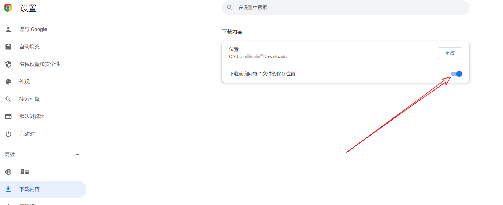

# 目录

- [1. 前言](#1-前言)
- [2. 一些UiBot软件使用技巧](#2-一些uibot软件使用技巧)
  - [2.1. 更改Creator【我的收藏】命令树下的命令顺序](#21-更改creator我的收藏命令树下的命令顺序)
  - [2.2. 一台电脑同时打开多个Creator或Worker](#22-一台电脑同时打开多个creator或worker)
    - [2.2.1. Creator](#221-creator)
    - [2.2.2. Worker](#222-worker)
- [3. 代码正确时，UiBot仍然报错的情况与解决方案](#3-代码正确时uibot仍然报错的情况与解决方案)
- [4. 来也UiBot认证相关思维导图](#4-来也uibot认证相关思维导图)
- [5. 部分常见场景的处理思路](#5-部分常见场景的处理思路)
  - [5.1. 浏览器「打开」或「另存为」窗口的文件路径选择](#51-浏览器打开或另存为窗口的文件路径选择)
- [6. UiBot代码相关知识](#6-uibot代码相关知识)
  - [6.1. 「在目标中输入」命令，【系统消息】、【后台输入】、【模拟输入】三者之间的区别、适用情况](#61-在目标中输入命令系统消息后台输入模拟输入三者之间的区别适用情况)
- [7. 项目过程中用过的命令库和脚本](#7-项目过程中用过的命令库和脚本)
  - [7.1. Python脚本](#71-python脚本)
  - [7.2. UiBot命令库](#72-uibot命令库)
- [8. 许可证](#8-许可证)

# 1. 前言

这里是我的UiBot笔记，内容包括：

* 我在工作、学习过程中遇到的疑难问题&解决办法；
* 来也UiBot认证考试过程中，个人整理的考点、操作步骤，注意不包含考试答案；
* RPA项目实施过程中，个人觉得有用的技能与教程；
* 其他我觉得值得分享的东西。

适用范围：

* 个人常用的UiBot软件是：Creator 5.6.2和5.5.6、Worker5.6.2和5.5.6；
* 本笔记中的内容，如果没有特别说明，对于5.5.0及以后的社区版、企业版都是通用的。

本笔记的更新以GitHub为主，原因：

* UiBot社区的检索功能不好用、很多计算机常用术语都是敏感词、回复没有通知、内容权利不受个人控制。

希望达成的目的：

* 记录与展示个人的工作、学习成果，帮助职业发展；
* 帮助与自己同样使用UiBot的程序员。

RPA行业还在高速发展中，如果随着时间发展，本笔记可以在此行业留下一些痕迹，帮助到一些工程师，那将会是一件十分有成就感的事情。

# 2. 一些UiBot软件使用技巧

## 2.1. 更改Creator【我的收藏】命令树下的命令顺序

Creator软件内是没有排序功能的，以及联系过来也支持人员，得到的答复也是无法排序，但经过研究，得出了排序的方法。

以我的企业版5.6.2为例（其他版本同理），步骤与解释：

1. 打开「UiBotCreator安装目录\5.6.2\db\」文件夹
2. 使用文本编辑器打开该文件夹下的favorite.db
3. 该文件内的内容结构是这样的：

   a. 每一行的文本就是一个命令所应对的字典
   b. 以其中的「注释」命令来举例，将其格式化一下，方便观察结构：

   ```python
   {
       "_groupName" : "Base",
       "_id" : "XlVzSWrPx3Ty5Atg",
       "args" : 
       [
           {
               "dataType" : "variable",
               "defaultValue" : "Rem",
               "desc" : "注释内容。",
               "inputType" : "textArea",
               "name" : "Rem",
               "propName" : "注释内容"
           },
           {
               "dataType" : "variable",
               "defaultValue" : "",
               "desc" : "需要显示的注释内容",
               "inputType" : "textArea",
               "name" : "sText",
               "propName" : "注释内容"
           }
       ],
       "commandDesc" : "用于给其他命令做注释说明，运行时没有任何效果。",
       "commandName" : "注释",
       "formatCode" : "Rem ",
       "propsGroup" : 
       [
           {
               "name" : "必选参数",
               "value" : 
               [
                   "#sText"
               ]
           }
       ],
       "srcCode" : "#Rem #sText",
       "time" : 1627894027311,
       "translateType" : 39,
       "visible" : true
   }
   ```

   c. 其中"time"字段就表示当时收藏该命令的毫秒时间戳，使用UiBot内置的「Unix时间戳转换为时间」，「格式化时间」命令，可以看到这个整数所对应的就是2021-08-02 16:47:07，我当初收藏它的时间
4. 那么我们只需要（先做好文件备份）在文本编辑器内，将希望排名靠前的命令字典的"time"字段整数改小，保存，关闭重开Creator，就可以了。（修改过程中如果觉得字典太长，挤在一行不方便，可以先复制字典文本到其他文本编辑器进行格式化，修改完成之后，再改为一整行的形式粘贴回去。）

举例，我将我特别常用的三个命令的"time"字段分别调整为了整数 `2，3，1`，修改前后截图如下：

（其中「调试中退出」、「pass」是我自定义的命令，不是官方内置命令，以及由于收藏的命令比较多，截图是拼接出来的，能够理解意思就行）


## 2.2. 一台电脑同时打开多个Creator或Worker

### 2.2.1. Creator

如果需要在两个项目之间复制粘贴代码，个人觉得最方便直观的方式，是同时安装安装不同版本的UiBot到不同文件夹，就可以实现同时打开多个Creator或Worker。


 打开每个目录中的「Creator.exe」，即可。

唯一发现的小问题，就是第二个打开的Creator无法显示最近的项目列表，手动打开需要处理的项目即可。


### 2.2.2. Worker

Worker同理，通过这种方式，可以实现同一台同时运行多个程序（前提是程序之间的界面操作不会互相影响），提高电脑资源利用率。

# 3. 代码正确时，UiBot仍然报错的情况与解决方案

待更新。

# 4. 来也UiBot认证相关思维导图

截至本部分内容编写，就我所知，来也目前的产品包括：

* RPA
  * UiBot Creator，流程代码编辑器
  * UiBot Worker，流程运行工具
  * UiBot Commander，流程管理网站
  * UiBot Mage，AI功能平台
* 对话机器人吾来（Chatbot）

对于上述产品，有三个来也进行考核与颁发的认证考试

* RPA认证
  * RPA实施工程师认证
    * 以UiBot Creator的使用为主，同时涉及到UiBot Worker、UiBot Commander、UiBot Mage
    * 有初中高，三个级别
    * [认证界面](https://academy.laiye.com/certificate)
  * UiBot业务应用认证（我没考过这两个证书，不细说）
    * RPA审计机器人认证
    * RPA财务机器人认证
  * 智能自动化平合售前工程师认证 （初级）（我没考过这两个证书，不细说）
* IDP认证
  * 以UiBot Mage的使用为主，同时涉及到UiBot Creator
  * 有初中，两个级别
  * [认证界面](https://academy.laiye.com/idp/certificate)
* Chatbot认证（我没考过这个证书，不细说）
  * 有初中，两个级别
  * [认证界面](https://academy.laiye.com/chatbot/certificate)

我在个人的学习过程中，整理了两个思维导图，有的地方写得不够详细，但应该对尚未获得UiBotRPA实施高级认证、IDP中级认证的读者有一定帮助：

* RPA实施工程师高级认证的考点
  * [源文件（使用MindMaster可编辑）](./UiBot%20RPA高级认证考点/UiBot%20RPA高级认证考点.emmx)
  * [思维导图PDF文件](./UiBot%20RPA高级认证考点/UiBot%20RPA高级认证考点.pdf)
* 个人阅读IDP官方手册，并实操之后整理的UiBot Mage操作说明
  * [源文件（使用MindMaster可编辑）](./UiBot%20Mage说明整理/UiBot%20Mage说明整理.emmx)
  * [思维导图PDF文件](./UiBot%20Mage说明整理/UiBot%20Mage说明整理.pdf)
  * [大纲HTML文件](./UiBot%20Mage说明整理/UiBot%20Mage说明整理-大纲.html)

# 5. 部分常见场景的处理思路

## 5.1. 浏览器「打开」或「另存为」窗口的文件路径选择

以谷歌浏览器为例，在网页上传文件或下载文件的时候（如果浏览器设置了「下载前询问每个文件的保存位置」），会弹出标题为「打开」或「另存为」的文件选择窗口。

业务流程中有的场景，需要选择指定文件夹下的文件，或者将文件放到指定路径。



我个人业务处理过程中，使用的方式是：直接将文件的完整路径（文件夹路径+文件名），填写到文件名输入框，Windows就会自动进行定位。

比如"D:\UiBot Files\\file\XXXXX.pdf"、"D:\测试\新建文本文档.txt"。

这样就不需要修改窗口的地址栏，方便很多。


# 6. UiBot代码相关知识

## 6.1. 「在目标中输入」命令，【系统消息】、【后台输入】、【模拟输入】三者之间的区别、适用情况

* 模拟操作，指通过调用系统api mouseevent等实现鼠标操作，会实际移动光标
* 系统消息，指发送鼠标消息到目标元素，不移动光标
* 后台输入，可以理解为调用了一次元素的鼠标响应回调函数

下述顺序中，由上往下为底层到上层，越底层兼容性越好，上层有速度和精准的优势：

1. 模拟
2. 消息
3. 后台

# 7. 项目过程中用过的命令库和脚本

## 7.1. Python脚本

待更新。

## 7.2. UiBot命令库

待更新。

# 8. 许可证

[MIT License](../LICENSE "开源许可证")
